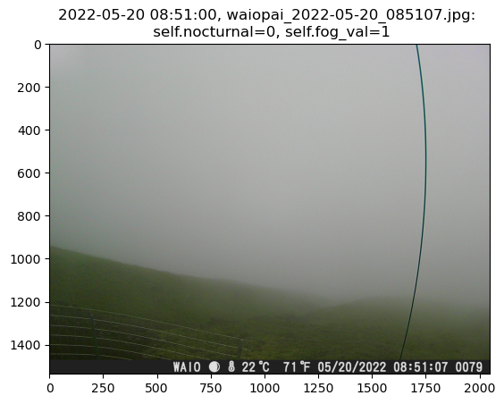

# FogVision
[](
https://github.com/jnicolow/FogVision/commits/)

[](https://opensource.org/licenses/MIT)


FogVision is an open-source Python framework for classifying mountain trail camera imagery by fog presence. First, image embeddings are computed using a pretrained ResNet50 model, and then a classification head was trained on ~40k images from 30 sites (separate classification head for diurnal and nocturnal imagery).




## 1. Installation<a name="introduction"></a>
Use `coastvision.yml` to create conda environment. This will take a few minutes.
```
cd path/to/CoastVision
conda env create -f coastvision.yml
conda activate coastvision
```

After successfully creating the environment, run through `example_notebook.ipynb` using the `fogvision` environment. This notebook provides example image classification code.
